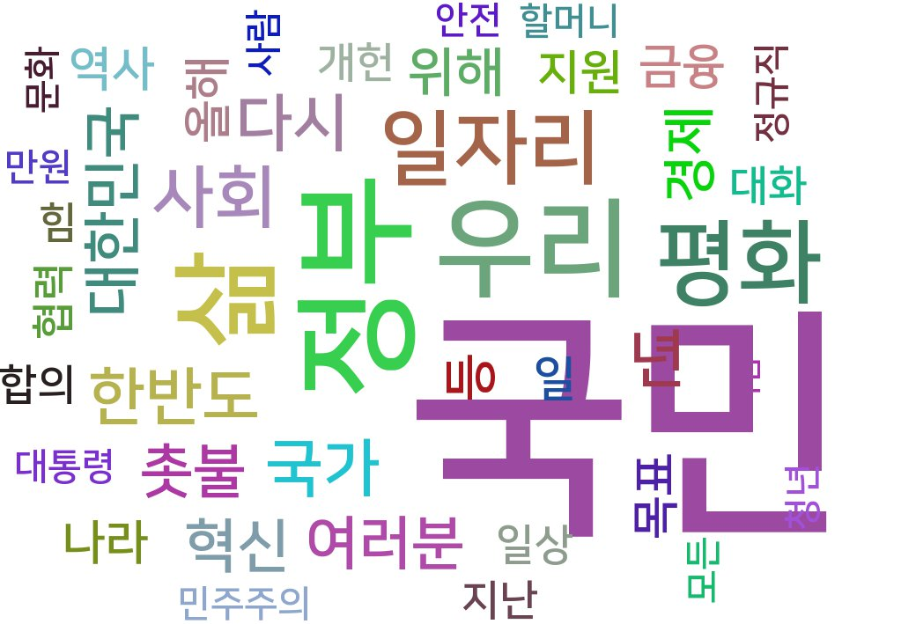

2018년 문재인 대통령 신년 인사 전문에 대한 워드 클라우드
=============================================

작업환경
----------

* 파이썬 3.4 환경
* konlpy, pygame 인스톨필요
* 한글폰트를 \Lib\site-packages\pytagcloud\fonts 에 복사
* fonts.json 편집
<pre><code>
{
    "name":"korean"
    "ttf":"폰트이름"
    "name":"다른항목것복사"
}
</code></pre>

결과
----

참고
https://goo.gl/7juEKu
